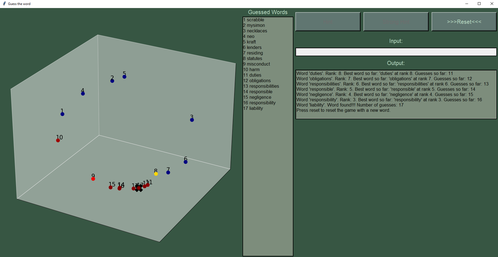

<h2>NLP - Word Guessing Game</h2>

In this game, players must guess a specific word randomly selected from a subset of the English vocabulary. After each guess, players receive feedback, both visually and through text, indicating the semantic similarity between their guess and the target word, which helps them in subsequent guesses. To determine semantic proximity, the game's backend constructs an embedding space of the vocabulary and computes cosine similarities between words. Additionally, players can request hints, receiving words that are semantically similar to the target word. With new words chosen for each round, the game provides multiple opportunities for play with varied outcomes.

